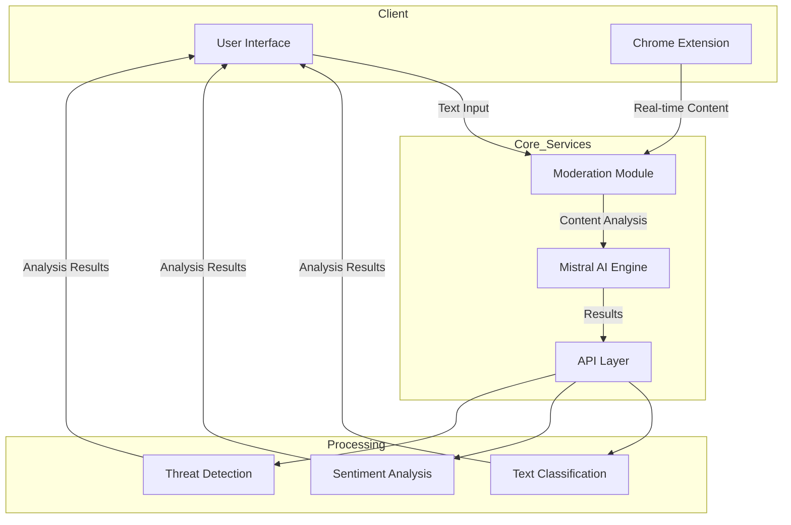
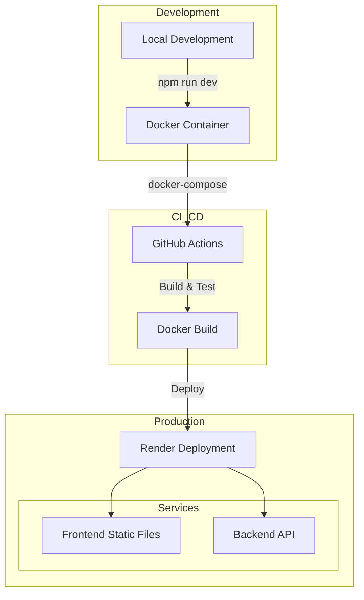
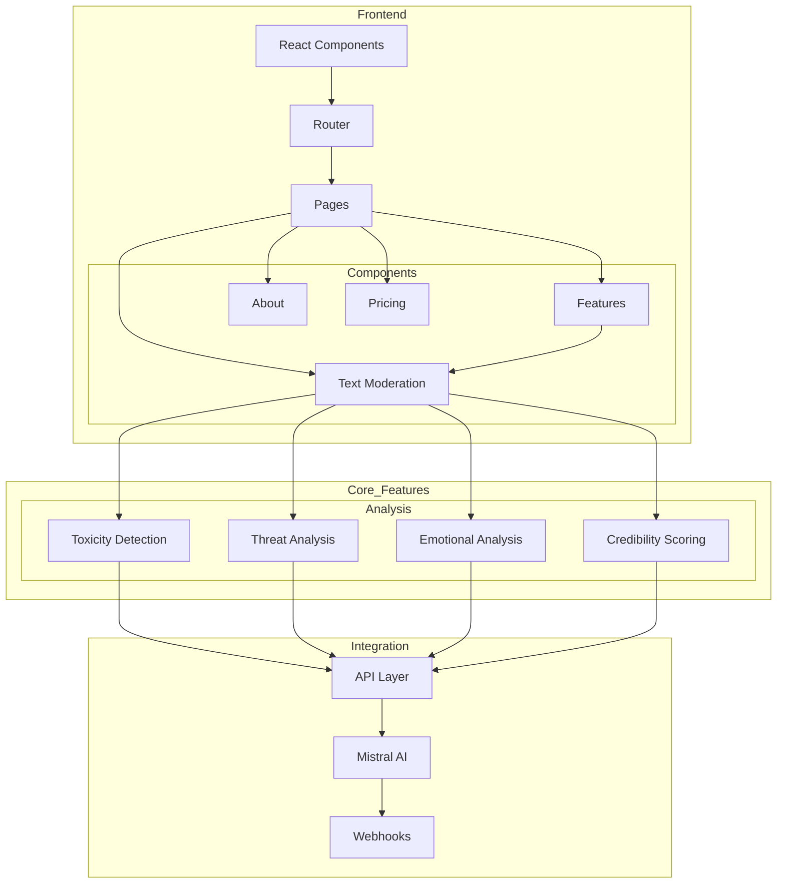

# Maverick AI - Content Moderation Platform

[](https://maverick-ai.onrender.com/)
[](https://opensource.org/licenses/MIT)

A powerful, real-time content moderation platform powered by Mistral AI, designed to create safer online spaces through intelligent content analysis.

## 🌟 Key Features

+ 🚀 **Real-time Analysis**
  - Instant content moderation
  - Fast response times
  - Live chat monitoring

+ 🛡️ **Advanced Detection**
  - Toxicity detection
  - Self-harm content identification
  - Threat detection
  - Inappropriate language filtering

+ 🌐 **Chrome Extension**
  - Browser-wide protection
  - Google Meet integration
  - Custom moderation preferences
  - Instant notifications

+ ⚡ **Performance**
  - High accuracy moderation
  - 7B+ parameter AI model
  - Support for 30+ languages
  - 24/7 availability

## 🛠 System Architecture

### Data Flow


### Deployment Architecture


### System Components


## 🛠️ Tech Stack

- Frontend: React 18 + TypeScript
- AI Engine: Mistral-7B
- Styling: Tailwind CSS
- Build Tool: Vite
- Backend: Node.js + Supabase
- CI/CD: Github Actions
- Containerization: Docker

## 🚀 Getting Started

### Prerequisites
- Node.js 16+
- Docker Desktop (for containerized deployment)
- Git

### Installation

1. Clone the repository
```bash
git clone https://github.com/yourusername/maverick-ai.git
cd maverick-ai
```

2. Choose your preferred setup method:

#### Via Docker
```bash
npm install
docker-compose up --build
# Access at http://localhost:3000
```

#### Via Node.js
```bash
npm install
npm run dev
# Access at http://localhost:5173
```

## 🔑 API Configuration

1. Request API access from project maintainers
2. Create `.env.local` file:
```env
VITE_MISTRAL_API_KEY=your_key_here
```

## 🧩 Chrome Extension

Our extension provides real-time content moderation across browsers:

1. Install from Chrome Web Store (coming soon)
2. Configure moderation preferences
3. Enjoy automatic content monitoring
4. Receive instant alerts for harmful content

## 🤝 Contributing

We welcome contributions! See our [Contributing Guidelines](CONTRIBUTING.md) for details.

## 📈 Project Stats

- Growing number of processed content pieces
- Powered by Mistral-7B language model
- Active development and improvements
- 24/7 Real-time Protection

## 🆘 Support & Contact

Need help? Contact our maintainers:

- Siddhesh Rajale ➡️ [](https://twitter.com/intent/follow?screen_name=Scholar_js)
- Mehul Pardeshi ➡️ [](https://twitter.com/intent/follow?screen_name=MehulPardeshi2)
- Divyesh Mali ➡️ [](https://twitter.com/intent/follow?screen_name=divyesh_mali_)

## 📄 License

MIT License - See [LICENSE](LICENSE) for details.
