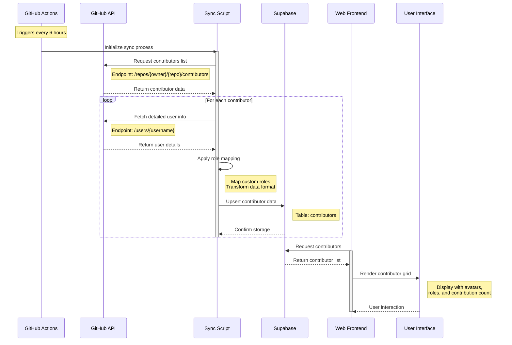
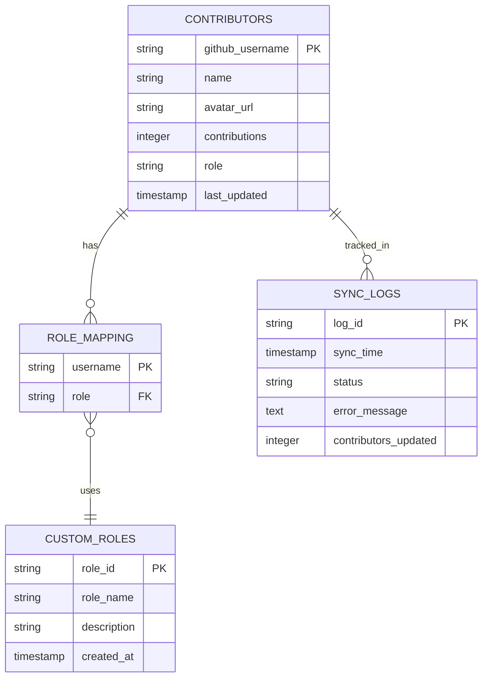
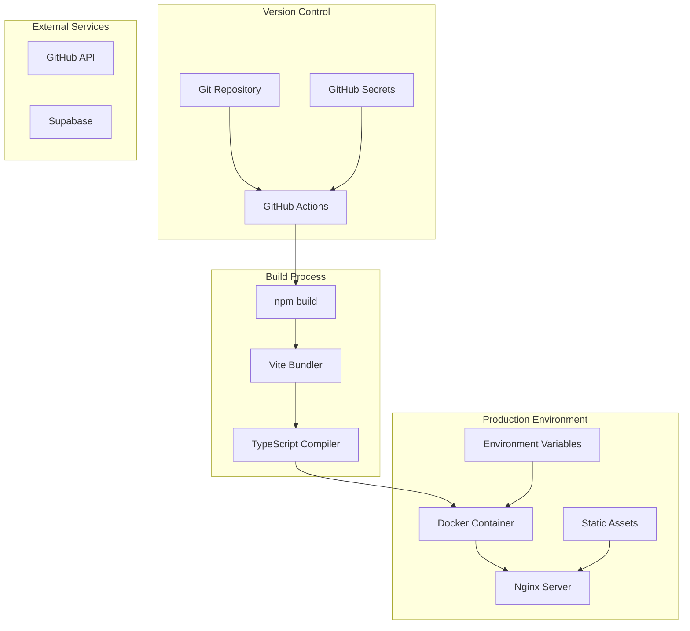
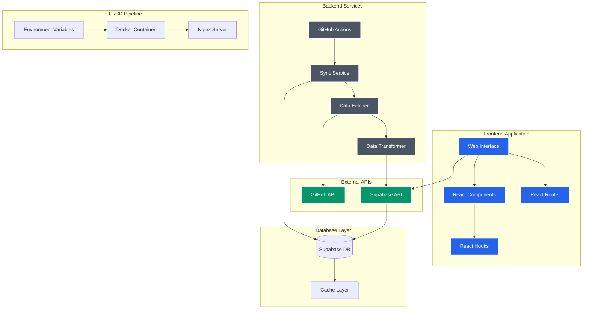

# Content Moderation Software

### Deploy Link : https://maverick-ai.onrender.com/
____

## AI-Powered Content Moderation Software

A modern, real-time content moderation platform powered by TensorFlow.js and advanced AI models to help protect online communities from harmful content.

### Purpose and Vision

This open source project aims to create a scalable, AI-powered content moderation software that can be integrated into various social media platforms and online communities. By offering an API, this software will enable platforms to seamlessly moderate text (and potentially image) content to ensure a safer environment for users. The long-term goal is to develop a robust, versatile solution that can be adopted by social media apps and other online platforms requiring effective content moderation.

In the future, this software API could serve as a comprehensive moderation backbone for various apps, handling moderation tasks across diverse platforms and helping developers maintain community standards. This vision allows the project to expand beyond individual applications, providing a reliable, adaptable, and scalable content moderation service.

### Features

+ 🚀 Real-time content analysis and moderation
+ 🛡️ Detection of multiple content categories:
+ Toxicity and hate speech
+ Spam and scam content
+ Inappropriate language
+ Personal attacks and threats
+ 📊 Detailed analysis reports with confidence scores
+ 💾 Exportable moderation reports
+ ⚡ Built with modern web technologies

### Tech Stack

+ React 18 with TypeScript
+ TensorFlow.js for AI-powered analysis
+ Tailwind CSS for styling
+ Vite for blazing fast development
+ Node js & Supabase for backend
+ Github Actions for CI/CD
+ Docker for containerization

### Getting Started

1. Fork the repository
2. Clone the repository: *git clone https://github.com/yourusername/content-moderation-software.git*

## Running the project

### 1. Via Docker
1. Install dependencies: *npm install* in root directory
2. Start Docker Desktop
3. Run command `docker-compose up --build` in root directory
4. In Docker Desktop, go to Containers section and select 'maverick-ai'. Now click on `3000:80` port to open website in browser

### 2. Via Node JS
1. Install dependencies: *npm install* in root directory
2. Start the development server: *npm run dev* in root directory

### How It Works

The application uses TensorFlow.js toxicity models to analyze text content in real-time. It evaluates content across multiple dimensions including:

+ Toxicity levels
+ Identity-based attacks
+ Insults and threats
+ Obscene content
+ Spam patterns
+ Inappropriate language
   
### Each analysis provides detailed feedback with:

+ Specific content flags
+ Confidence scores
+ Context highlighting
+ Overall toxicity assessment
---

### Data Flow Architecture

---

### Database Schema

---

### Deployment

---

### System Components

---
   
## Contributing

#### Contributions are welcome! Please feel free to submit a Pull Request.

## License

#### MIT License - feel free to use this project for your own purposes.
